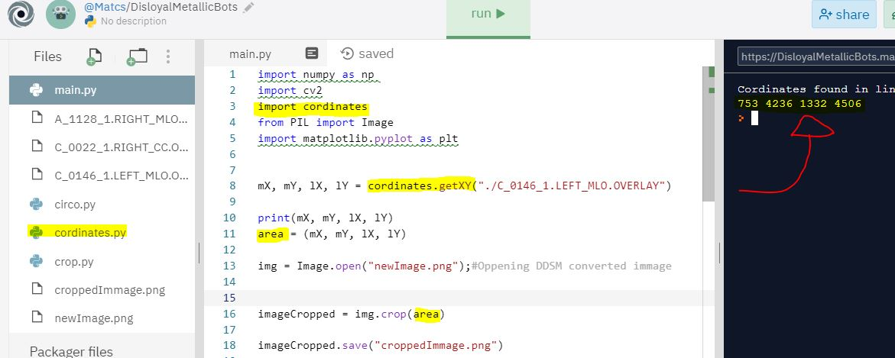

# getROI-DDSM

Ultility created to get the first and last cordinates(x,y) of the ROI(Region of intrest), so it can be cropped by using the crop function from PIL

1. I have created this ultility to get the first and last cordinates(X,Y) of the ROI(Region of interest), so it can be used with the crop function of PIL to crop exactly the aread with cancer, you just have to pass the OVERLAY file that corresponds to the immage you wanna.

2. You just have to pass the .OVERLAY file that corresponds to the DDSM immage you want:
   Example: In your python code,

```
import cordinates

lx, ly, gx, gy = cordinates.getXY(overlayFilePath)
cord = (lx, ly, gx, gy)
from PIL import Image

img = Image.open(YourDDSMConvertedImage) #This immage should be converted to a readable format, not be in LJPEG format.

imageCropped = img.crop(cord)

img.save("cropppedNew.png")

```

3. Obs: The cordinates file have to be in the same folder as your python code, or you can append the the directory the the file is stored in your python code. And also, the overlay file should correspond the immage you want to crop(same name).


